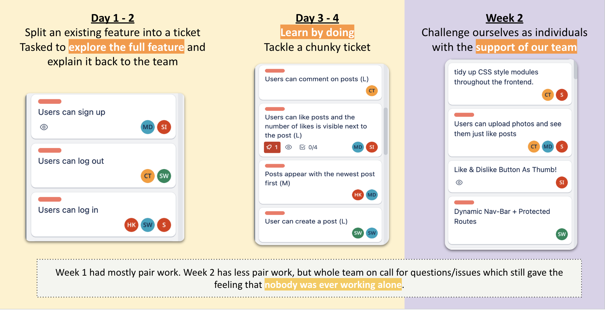

# WEEK 8-9 Group Enginering Project II: Acebook

## Contents

---
---

* [Goals](#weekly-goals)
* [Weekly Goals](#weekly-goals)
* [Reflections](#reflections)
* [Useful Tips](#useful-tips)

## Goals

* [x] Learn to navigate a legacy codebase.
* [x] Learn to build production-quality software in a team.
* [x] Be able to effectively work in an Agile environment (being able to respond to change.)
* [x] Learn how to build an App using the MERN stack.

## Plan

* Learn by doing: tackle ticket by ticket
* explore existing feature from the existing codebase
* attend check-ins, standups and meetings with the group

## Evidence

* [Engineering Project II: Acebook](https://github.com/maddc0de/acebook)
* [Team Earth Project link](https://github.com/siqbal181/acebook-mern-template)

---

## Weekly Goals

### week 1 9th - 12th May

* [x] Understand the file structure in a bird's eye view
* [x] Complete a ticket
* [x] Attend workshops

### week 2 15th - 19th May

* [x] Complete Upload a photo feature
* [x] write e2e testing with Cypress
* [x] To be able to present the project with the team.

---

## Reflections

What I have learnt:

* MERN Stack and other technologies
* Cypress Testing
* Agile methodology
* uinsg MVP to guide our process

Navigating a legacy codebase was a significant challenge, but through collaboration and effective communication within the team, we were able to understand the codebase's structure and functionality. Building production-quality software as a team allowed me to develop my skills in a real-world setting and understand the importance of collaboration, code reviews, and maintaining code quality.

Working in an Agile environment was a key aspect of this project, and I am proud to say that I have adapted well to this methodology. Being responsive to change and actively participating in daily stand-ups, sprint planning, and retrospectives helped our team stay focused and achieve our goals efficiently.

One of the highlights of this project was learning and implementing the MERN stack. Through hands-on experience, I gained proficiency in technologies such as MongoDB, Express.js, React, and Node.js. Additionally, exploring Cypress testing provided me with the skills to write end-to-end tests, ensuring the quality and reliability of our application.

The distribution of work in our team was well-balanced and collaborative. During the first week, we paired up and tackled substantial tickets, which allowed us to explore the existing feature and share our knowledge with the team. In the second week, we took on individual challenges while still having the support and assistance of our team members. Regular communication, quick responses to questions or issues, and being available for each other fostered a sense of collaboration and ensured that nobody felt isolated while working on their tasks.

We maintained a high standard of work by implementing strong communication practices, including branch protection, clear commit and pull request messages, and addressing complexity beyond the MVP. Our commitment to testing evolved throughout the project. Initially, we had confidence in running tests before delving into the codebase. However, there was a period of test avoidance due to unfamiliarity and fear of the existing technologies. Eventually, we faced the tests head-on, addressing them as a team and understanding their importance in maintaining code quality and stability.

In conclusion, this project has provided me with valuable experience and growth as a software engineer. I have gained proficiency in the MERN stack, improved my ability to navigate a legacy codebase, and strengthened my understanding of Agile methodologies and collaborative development. Moving forward, I will continue to build on these skills and strive for continuous improvement in my work as a software engineer.

## Useful Tips

* [Engineering Project II guide](https://github.com/makersacademy/engineering-project-2)
